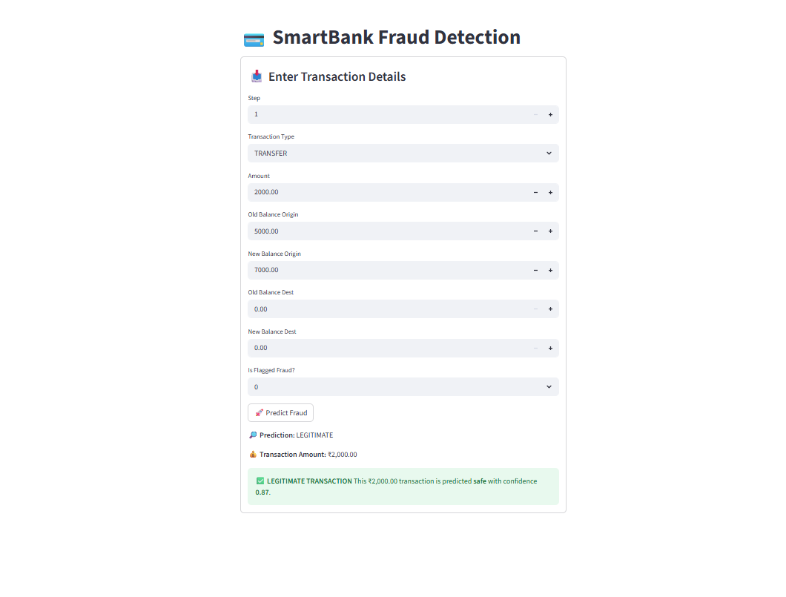
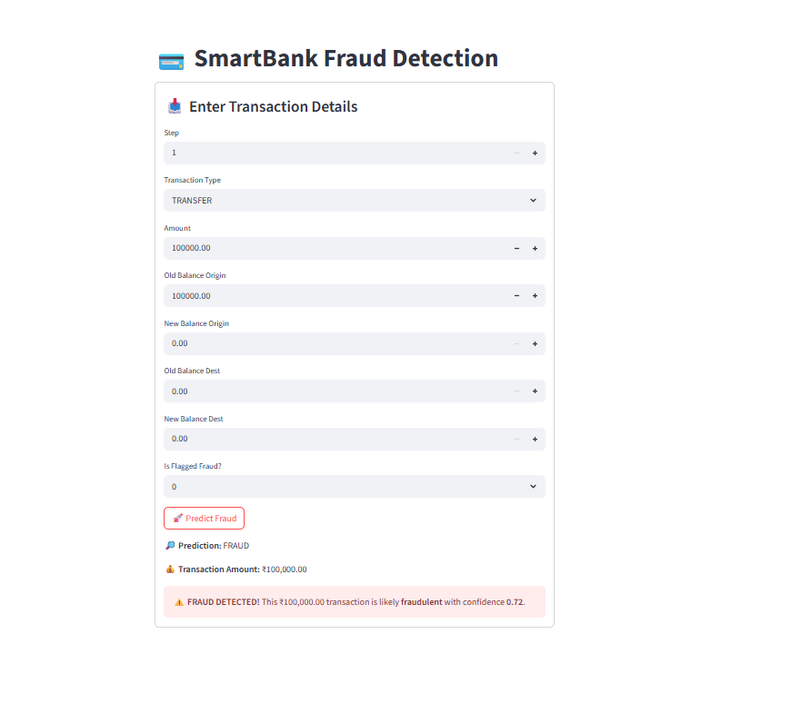

# 💳 SmartBank Fraud Detection

A Machine Learning-powered Streamlit web application to detect fraudulent bank transactions. This project analyzes financial transaction data to classify whether a transaction is legitimate or fraudulent.

---

## 📌 Features

- Trains models on real-world transaction data
- Applies **SMOTE** to handle class imbalance
- Supports Logistic Regression, Random Forest, and XGBoost
- Predicts fraud based on transaction details
- Interactive Streamlit UI for real-time predictions
- Displays prediction confidence and fraud alert

---

## 🧠 Algorithms Used

- Logistic Regression
- Random Forest ✅ (Best-performing model)
- XGBoost

---

## 📁 Project Structure

SmartBank_Fraud_Detection/
│
├── app/ # Streamlit frontend
│ └── app.py
│
├── data/ # Dataset
│ └── PS_20174392719_1491204439457_log.csv
│
├── models/ # Trained model
│ └── model.pkl
│
├── notebooks/ # EDA and visualization scripts
│
├── utils/ # Prediction logic
│ └── predictor.py
│
├── train.py # Model training and saving
├── requirements.txt # Python dependencies
└── README.md

---

## 🚀 How to Run

1. **Clone the repository**
```bash
#git clone https://github.com/your-username/SmartBank_Fraud_Detection.git
#cd SmartBank_Fraud_Detection
2.Create a virtual environment
python -m venv venv
venv\Scripts\activate    # On Windows
3.Install dependencies
pip install -r requirements.txt
4.Train the model
python train.py
5.Launch the Streamlit app
streamlit run app/app.py
6.Screenshots


7.📊 Dataset
.Original dataset: Kaggle - Fraud Detection
.Contains ~6 million transactions with isFraud and isFlaggedFraud labels
8.Fraud Detection Criteria
The model considers factors like:
Transaction type (TRANSFER, CASH_OUT, etc.)
Sudden drop in origin balance
Unchanged destination balances
High transfer amounts


